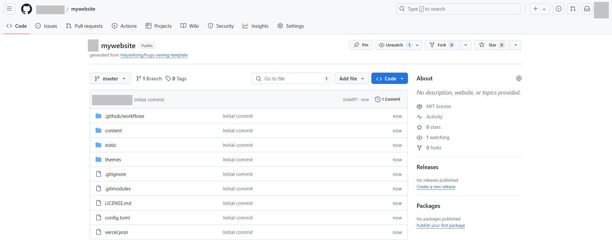
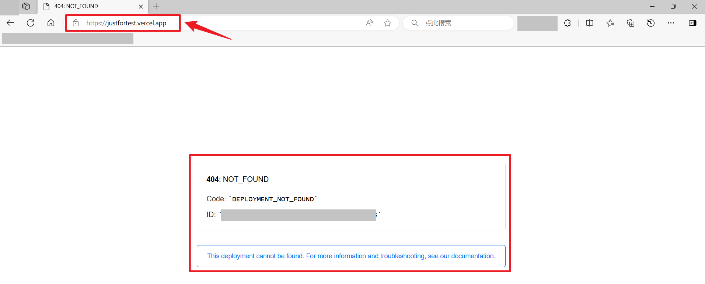
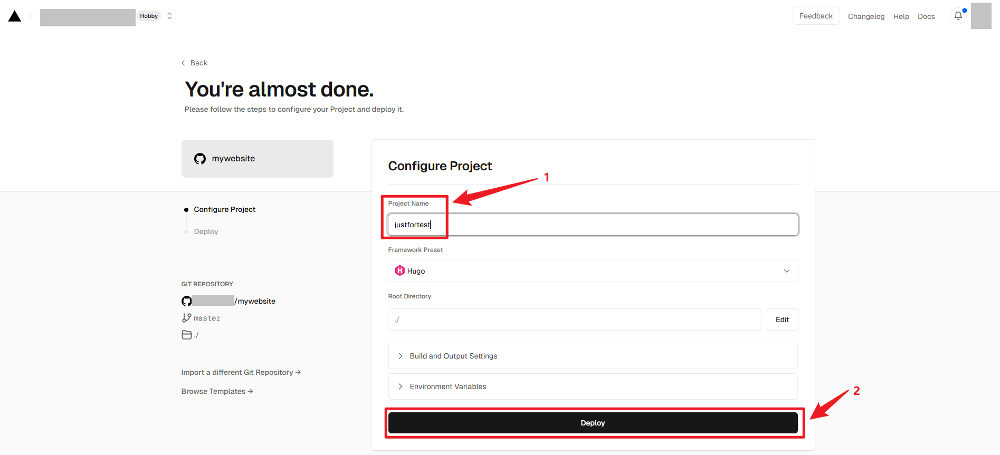
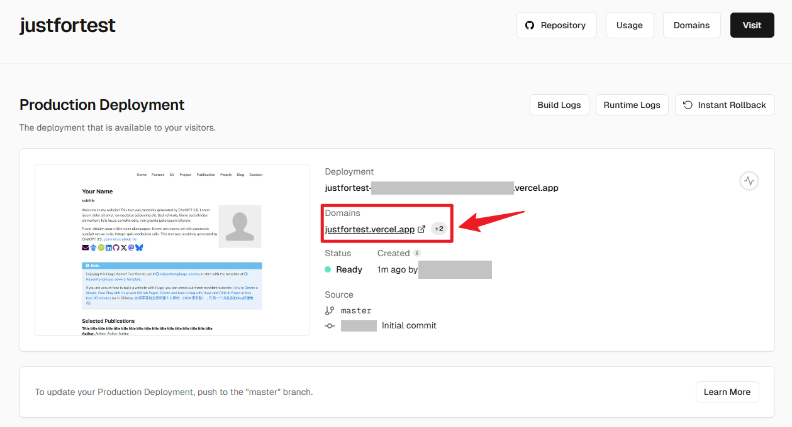

# 如何使用该模板

## Step1，在 GitHub 中复制模板

如图 1 所示，进入 [HaiyanKong/hugo-sewing-template](https://github.com/HaiyanKong/hugo-sewing-template)，点击“Use this template”，再点击“Create a new repository”。

图 1

如图 2 所示，给即将建立的网站仓库起一个名字，图中所示为“mywebsite”，你可以任意起名字，该名字与网站最终的链接地址无关。注意要让该仓库公开。

图 2

随后你会得到如图 3 所示的仓库。

图 3

## Step2，将模板导入 Vercel

来到 [Vercel](https://vercel.com/)，使用你当前使用的 GitHub 登录即可，然后将上一步得到的仓库导入，如图 4 所示。

图 4

给项目起一个名字，注意该名字就和你的网页地址相关联，最终你会得到 projectname.vercel.app/projectname-32524.vercel.app 。后续可以在 setting>> domain 里面修改网页地址。

图 5

图 6

## Step3，最终

按照图 6 所示设置完毕后，你会得到一个类似于图 7 的页面，显示正在部署。

图 7

稍等片刻后，你会得到类似于图 8 的页面，这说明你的页面已经部署完毕，点击“continue to dashboard”，会进入图 9 所示的页面，你可以发现你的 Domians 是你在第 2 步设定的 projectname.vecel.app，点击它，就会得到和 hugo-sewing.vercel.app 类似的页面。

图 8

图 9

最后，你可以根据你的偏好对 GitHub 仓库内容进行修改，Vercel 部分就基本不需要修改了，它会根据在 GitHub 提交的内容自动部署。