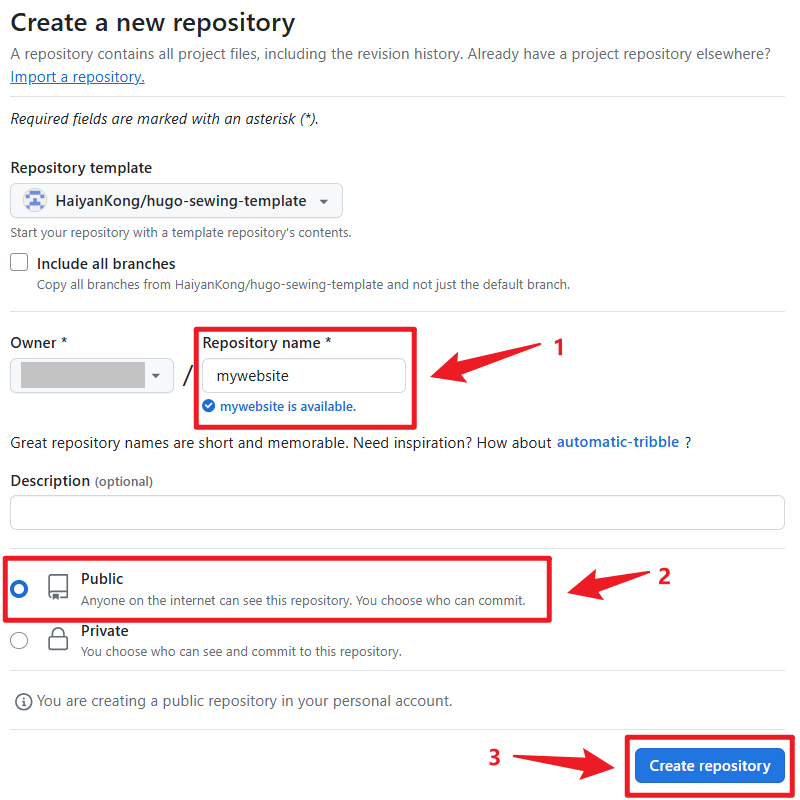
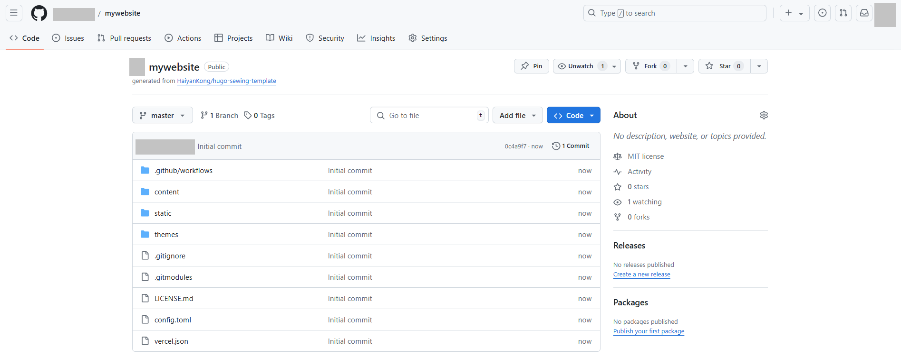
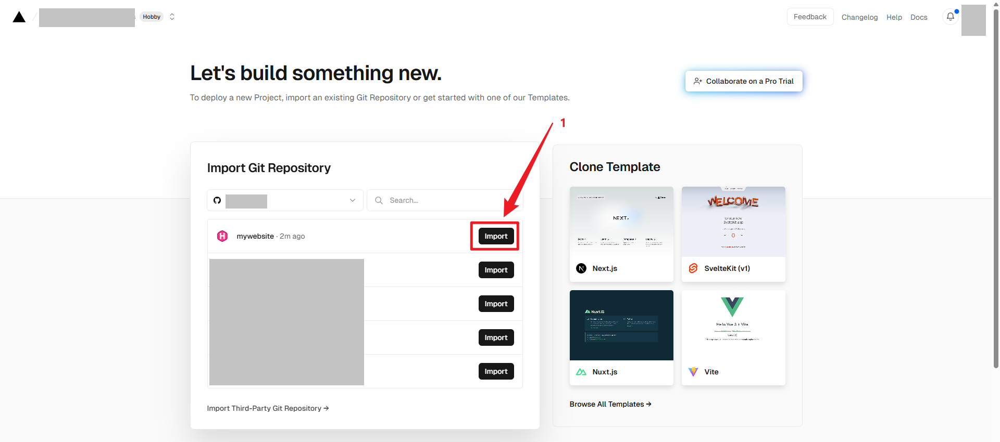
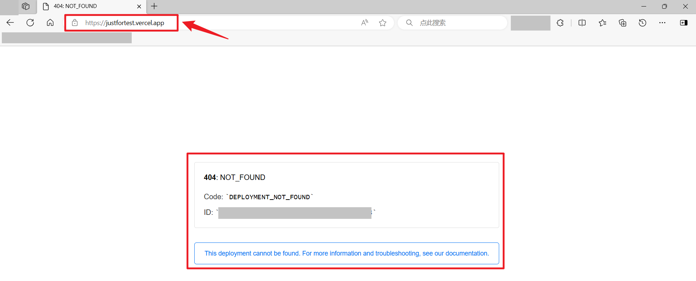
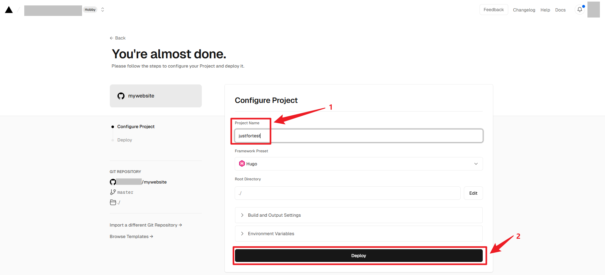
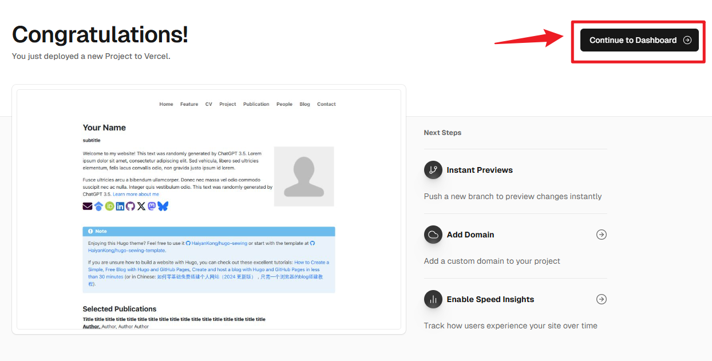
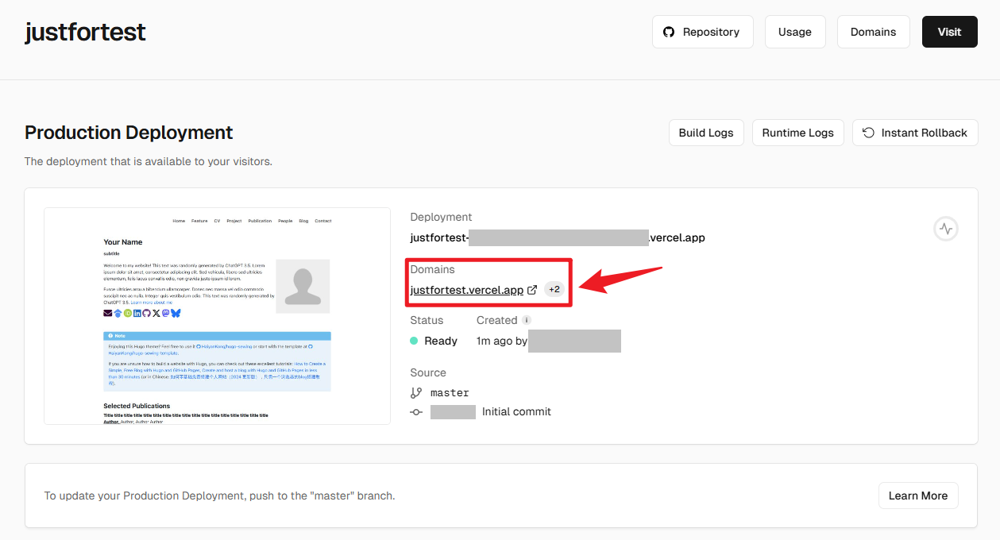

# How to use this template

[Chinese version 中文版](https://github.com/HaiyanKong/hugo-sewing-template/blob/master/README-zh.md)

## Step 1: Copy the Template from GitHub

As shown in Figure 1, go to [HaiyanKong/hugo-sewing-template](https://github.com/HaiyanKong/hugo-sewing-template) on GitHub. Click on “Use this template,” then click “Create a new repository.”

Figure 1

As shown in Figure 2, give your new website repository a name. In the example, it's called “mywebsite,” but you can choose any name. This name does not affect the final URL of your website. Make sure to set the repository as public.

Figure 2

You will then receive a repository as shown in Figure 3.

Figure 3

## Step2: Import the Repository into Vercel

Go to [Vercel](https://vercel.com/) and log in using your GitHub account. Then, import the repository you created in the previous step, as shown in Figure 4.

Figure 4

Give your project a name. Note that this name will be part of your website URL, resulting in a URL like **projectname.vercel.app** or **projectname-32524.vercel.app** . 

Figure 5

Figure 6

## Step 3: Final Steps

Once you’ve set everything up as shown in Figure 6, you will see a page similar to Figure 7 indicating that deployment is in progress.

Figure 7

Wait a moment, you will see a page similar to Figure 8, showing that your websitee has been successfully deployed. Click “Continue to Dashboard” to reach the page shown in Figure 9. Here, you'll find your domain listed as **projectname.vercel.app**. Click on it you will see a page similar to **hugo-sewing.vercel.app**. 

Figure 8

Figure 9

You can now customize the content of your GitHub repository according to your preferences. Vercel will automatically deploy changes based on the updates you make to the GitHub repository.